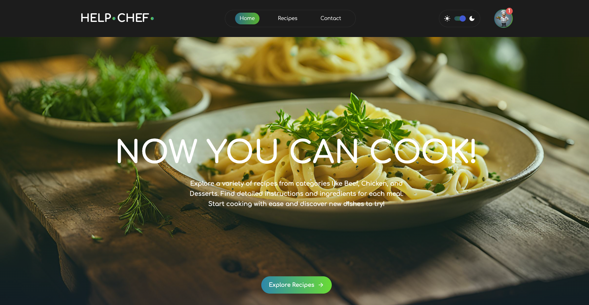
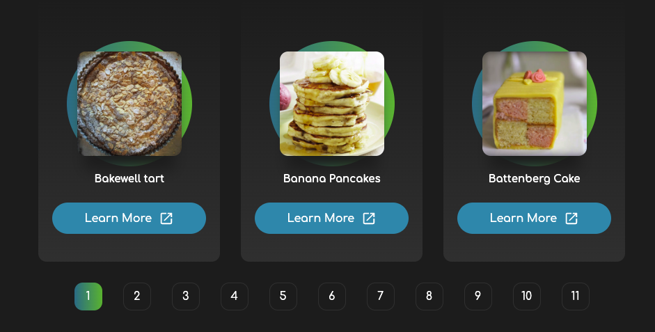
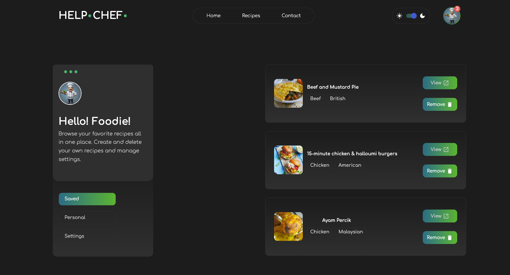

# Help Chef Recipe App

The Help Chef Recipe App is a React-based web application where users can browse, search, and save their favorite recipes. The app offers a range of features including light/dark mode, pagination, and smooth animations, providing a delightful experience for users to explore various meals and detailed instructions.

[Live Demo](https://victorkevz.github.io/help-chef-recipe-app/)

Table of Contents
Table of Contents
- [Overview](#overview)
- [Features](#features)
- [Technologies Used](#technologies-used)
- [Setup](#setup)
- [Future Improvements](#future-improvements)
- [Acknowledgments](#acknowledgments)

## Overview

The Help Chef Recipe App is a full-featured recipe application where users can:

- Search for recipes by name.
- View detailed instructions for each recipe.
- Save favorite recipes to local storage.
- Remove saved recipes from the favorites list.
- Toggle between light and dark mode.
- Experience smooth animations and page transitions with Framer Motion.
- Enjoy pagination for browsing large sets of meals.

## Features


- Fetch & Display Recipes: Recipes are fetched from an API and displayed in a responsive grid.
- Detailed Recipe Page: Each recipe has a detailed page that shows ingredients, measures, instructions, and a meal image.
- Accordion for Instructions: Instructions are presented within an accordion, allowing users to toggle steps for better readability.
- Favorites Feature: Users can save and remove favorite recipes, with data stored in local storage.
- Search Functionality: Users can search for specific recipes by name or area.
- Pagination: To limit the number of meals displayed on one page, pagination is implemented with buttons to navigate between pages.
- Theme Switcher: Users can switch between light and dark mode, with the preference being saved to local storage.
- Responsive Design: The app is fully responsive, providing a good user experience across various screen sizes.
- Framer Motion Animations: Smooth animations enhance user interaction and visual appeal.

## Technologies Used

-	React: JavaScript library for building user interfaces.
-	React Router: For handling navigation and routing.
-	Framer Motion: For adding smooth animations and transitions.
-	CSS: For responsive layout and styling.
-	LocalStorage: To store favorite recipes and theme preferences (light/dark mode).
-	MUI Icons: For icons like add/remove steps and external links.

Setup

To run this project locally:

1.	Clone the repository:

```git clone https://github.com/VictorKevz/help-chef-recipe-app.git

```

2.	Navigate to the project directory:

```cd help-chef-recipe-app
```

3.	Install the dependencies:

```npm install
```

 4.	Start the development server:

```npm run dev
```

5.	Open http://localhost:3000 to view the app in your browser.

## Future Improvements

-	Recipe Creation: Allow users to create and add their own custom recipes.
-	Recommendation System: Suggest recipes based on user preferences or past favorites.
-	Accessibility Enhancements: Improve accessibility features like better screen reader support and keyboard navigation.
-	Performance Optimization: Optimize API call handling and caching for faster load times.

## Acknowledgments

-	Thanks to the MealDB API for providing the recipe data.
-	Special thanks to the open-source community and online resources for guidance on various features.

